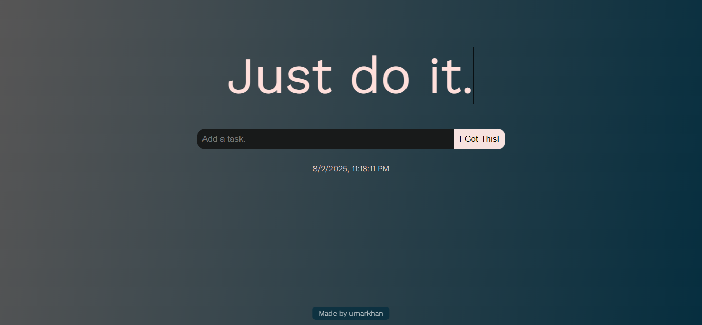
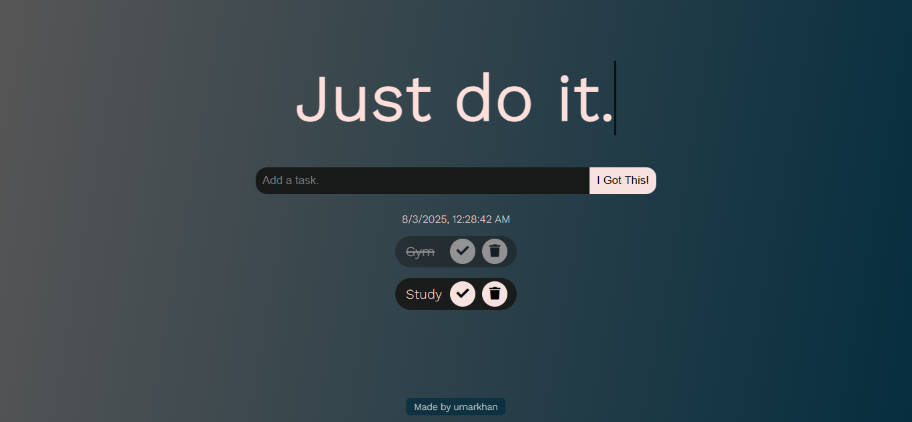

# To-Do List App


A responsive **To-Do List web application** that allows users to manage tasks efficiently with real-time date and time display. Built using **HTML, CSS, and JavaScript**, featuring task creation, completion tracking, and local storage support.

---

## Features

- Add, edit, and delete tasks easily
- Mark tasks as completed with visual indicators
- Persistent storage using **localStorage**
- Displays **real-time date and time** on the UI
- Responsive design for desktop and mobile devices

---

## Live Demo

[View Live Demo](https://to-do-list-by-umarkhan.netlify.app/)

---

## Screenshots

| Main Screen              | Adding Task               |
| ------------------------ | ------------------------- |
|  |  |

---

## Setup

1. Clone the repository:

   ```bash
   git clone https://github.com/Umar-khan6/todo-list-app.git
   ```

2. Open `index.html` in your browser or serve via local server.

---

## Deployment (GitHub Pages)

1. Push your code to a GitHub repository.
2. Go to **Settings → Pages**.
3. Under **Source**, choose `main` branch and `/root`.
4. Save — your app will be live at:  
   `https://yourusername.github.io/todo-list-app/`

---

## Technologies Used

- **HTML5**
- **CSS3 (Flexbox/Grid)**
- **JavaScript (DOM Manipulation, LocalStorage)**

---

## Contact

Feel free to connect with me:

- **LinkedIn:** [umarkhan24](https://linkedin.com/in/umarkhan42)
- **GitHub:** [Umar-khan6]https://github.com/Umar-khan6
- **Email:** umarkhan655020@gmail.com
